# Analytical Approach

Using the flow density relationsip and the equation for spacing at equilibrium, one can write Q as a function of v and the IDM parameters - v0,T and s0.

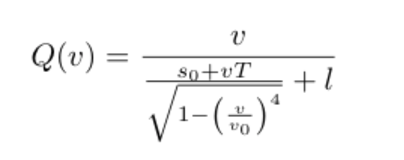

Taking the partial derivatives of Q wrt to the IDM parameters and playing around with "realistic bounds" mentioned in https://tigerprints.clemson.edu/cgi/viewcontent.cgi?referer=&httpsredir=1&article=2936&context=all_theses, we get the following plots.

## For fixed s0 (s0=2)
<table>
  <tr>
    <td> Partial derivative of Q wrt to s0</td>
    <td> Partial derivative of Q wrt to T</td>
    <td> Partial derivative of Q wrt to v0</td>
  </tr>
  <tr>
    <td>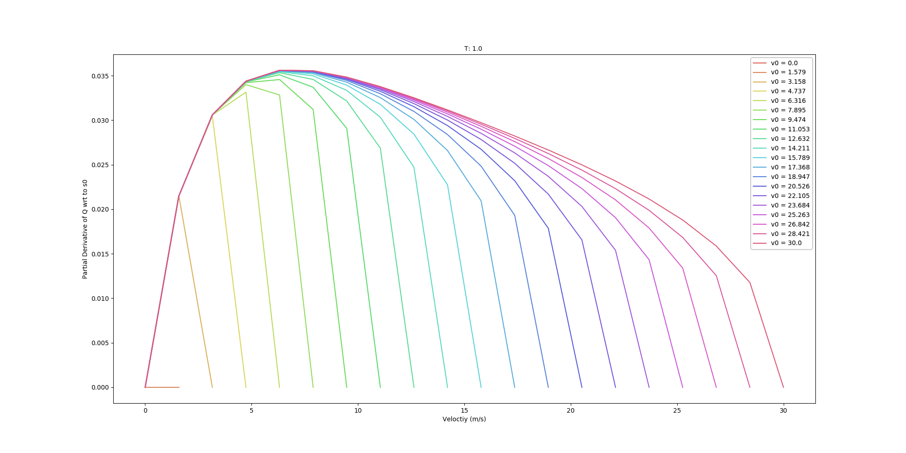</td>
    <td>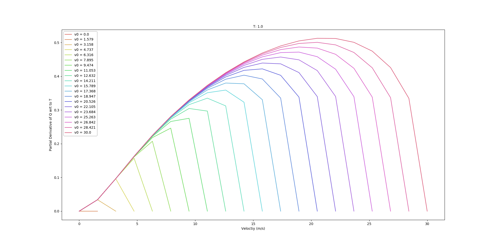</td>
    <td>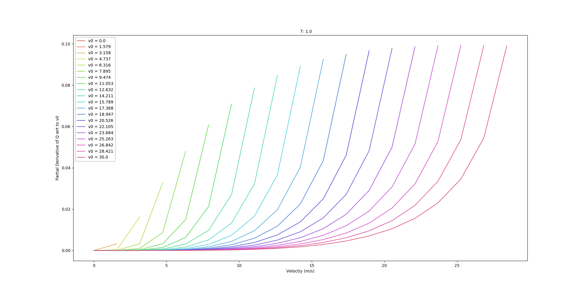</td>
  </tr>
</table>

## For fixed v0 (v0=30)
<table>
  <tr>
    <td> Partial derivative of Q wrt to s0</td>
    <td> Partial derivative of Q wrt to T</td>
    <td> Partial derivative of Q wrt to v0</td>
  </tr>
  <tr>
    <td>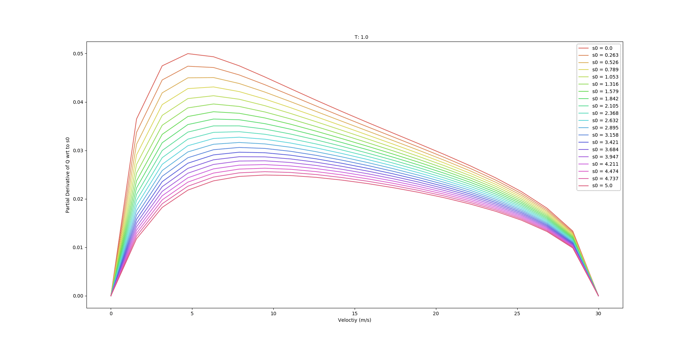</td>
    <td>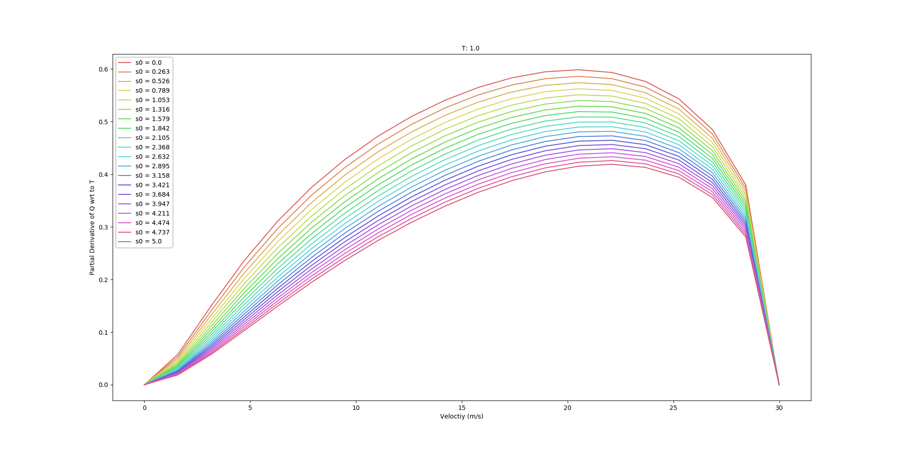</td>
    <td>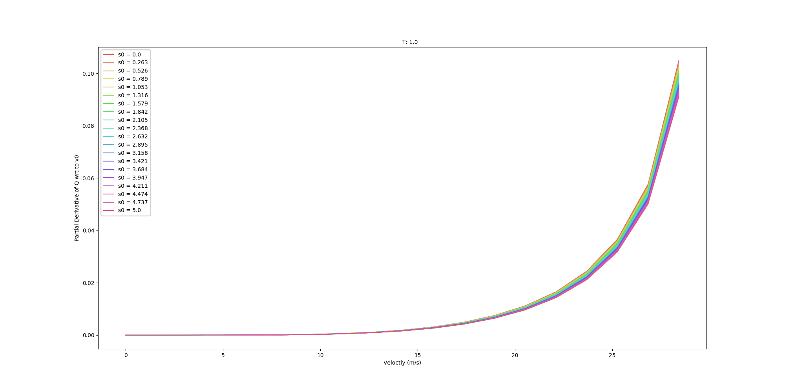</td>
  </tr>
</table>


## Q V Graphs
<table>
  <tr>
    <td> Q vs V plot for fixed v0 and T</td>
    <td> Q vs V plot for fixed s0 and T</td>
    <td> Q vs V plot for fixed v0 and s0</td>
  </tr>
  <tr>
    <td>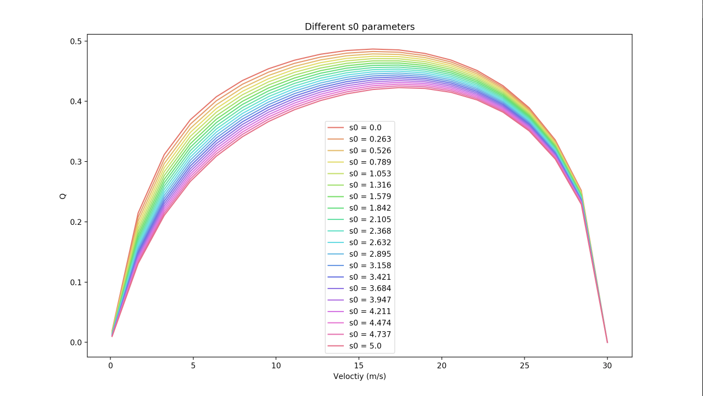</td>
    <td>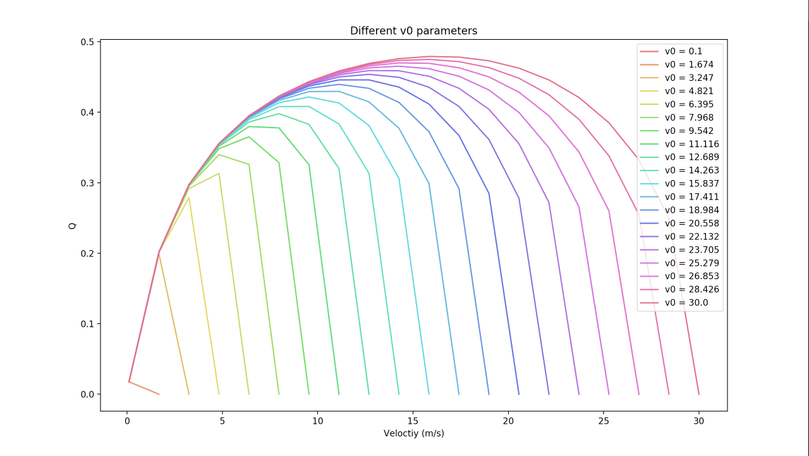</td>
    <td>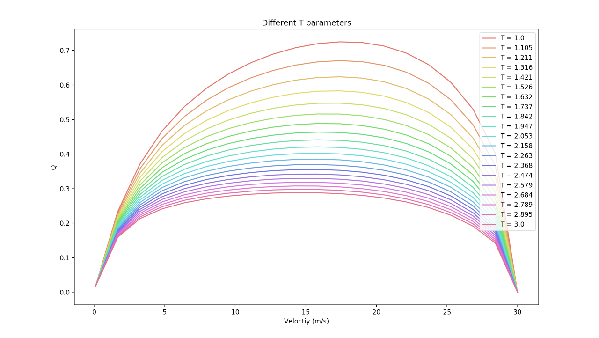</td>
  </tr>
</table>

# Optimization Routine

### High Level Algorithm
```
1) define realistic IDM params #IDM params have the form [a,b,v0,T,delta,s0]
2) run a sim to get the corresponding counts and speed data using the realistic IDM params and store as seperate arrays (measured_counts, measured_speeds)
3) define an initial guess for the IDM params
4) define the upper and lower bounds for each IDM param
5) define the objective function as follows:
      #we consider three variations of the objective function
      #counts error, speed error, both counts and speed error
      #since the counts data are an array of form [count1, count2, ... ]
      error = ((simmed_counts - measured_counts)**2).sum() + lambda* ((simmed_speed - measured_speed)**2).sum() 
start the optimization routine using the Nelder-Mead solver to minimize the objective function.
```

### Choice of Solver

I ran a toy simulation to test out which solver was the most efficient and accurate solver out of all the solvers that don't require a Jacobian.


# Table of contents:
* [counts calibrations](#1)
* [speed calibrations](#2)
* [speed and counts calibrations](#3)
* [longer sim time calibrations](#4)
* [artificial noise added calibrations](#5)
* [non constant inflow rate calibrations](#6)

## For initial guess of [ 0.5, 0.5, 20, 1, 1, 0.1] % a,b,v0,T,delta, s0 <a name="1" /> ## 

The optimization terminated successfully with the following output:

```bash
Current function value: 1.000000
         Iterations: 32
         Function evaluations: 129
 final_simplex: (array([[ 0.49537037,  0.50752315, 20.2037037 ,  0.97777778,  1.01666667,
         0.10037037],
       [ 0.49537135,  0.50752917, 20.20367335,  0.97778033,  1.01666452,
         0.10037028],
       [ 0.49537178,  0.50752219, 20.20371275,  0.97778456,  1.01666701,
         0.10037073],
       [ 0.49537146,  0.50752468, 20.2036393 ,  0.97777676,  1.01666675,
         0.10037109],
       [ 0.49537351,  0.5075245 , 20.20372156,  0.9777715 ,  1.01666681,
         0.1003708 ],
       [ 0.49537027,  0.50752537, 20.20369171,  0.97777785,  1.01666707,
         0.10037064],
       [ 0.49537208,  0.50752337, 20.20374954,  0.97777986,  1.01666533,
         0.10037079]]), array([1., 1., 1., 1., 1., 1., 1.]))
           fun: 1.0
       message: 'Optimization terminated successfully.'
          nfev: 129
           nit: 32
        status: 0
       success: True
             x: array([ 0.49537037,  0.50752315, 20.2037037 ,  0.97777778,  1.01666667,
        0.10037037])
```

### Expected Parameters
```python
realistic_params = [0.73, 1.67, 25, 1.6, 4, 2] # a,b,v0,T,delta, s0
```
While, the optimization did find solution it is most certainly a local one, since the optimized parameter set of  [0.49537037,  0.50752315, 20.2037037 ,  0.97777778,  1.01666667, 0.10037037] is far from that of the expected set.

This suggests that the search space is bumpy with multiple minimas.

## For initial guess of [ 1,1.5,30,1,4,2] (i.e. the default Flow IDM parameters)

The optimization routine went on for 2 hours before I force quit it, the log output showed that it was stuck at the same set of values for a long period of time.

## Optimizing only T, v0 and s0 parameters 

The optimization terminated successfully with the following output:

```bash
Optimization terminated successfully.
         Current function value: 1.000000
         Iterations: 22
         Function evaluations: 74
 final_simplex: (array([[20.06770833,  0.99053819,  0.10315104],
       [20.06772868,  0.99053786,  0.10314911],
       [20.06771596,  0.99052993,  0.10315052],
       [20.06765705,  0.99052955,  0.10315066]]), array([1., 1., 1., 1.]))
           fun: 1.0
       message: 'Optimization terminated successfully.'
          nfev: 74
           nit: 22
        status: 0
       success: True
             x: array([20.06770833,  0.99053819,  0.10315104])
```

While, the optimization did find solution it is most certainly a local one, since the parameters don't match the expected parameter set. The simulation however ran a lot faster. This result confirms the initial hypothesis of the search space being very bumpy.

## Optimizing T, v0 and s0 parameters with delta = 2 instead of 4

Used the lower bound values as initial guess.

```bash
Optimization terminated successfully.
         Current function value: 7.000000
         Iterations: 29
         Function evaluations: 86
 final_simplex: (array([[17.92540676,  1.08776601,  0.10099049],
       [17.92542432,  1.08775289,  0.10099177],
       [17.92535129,  1.0877661 ,  0.10099159],
       [17.92545361,  1.08775929,  0.10099163]]), array([7., 7., 7., 7.]))
           fun: 7.0
       message: 'Optimization terminated successfully.'
          nfev: 86
           nit: 29
        status: 0
       success: True
             x: array([17.92540676,  1.08776601,  0.10099049])
```

Reached a different local minima as predicted by Dr. Work. 

 
## Optimizing T, v0 and s0 parameters with default IDM parameters

Used the lower bound values as initial guess.

Initial error was really high compared to other simulation tests.

### Obeservation: zero error was recorded a couple of times but the optimization regime didn't stop. Does this confirm that the search space is flat like Dr. Work was talking about?

Optimization terminated successfully.
         Current function value: 0.000000
         Iterations: 36
         Function evaluations: 104
 final_simplex: (array([[26.33333333,  0.8       ,  0.08      ],
       [26.33330936,  0.79999911,  0.0800001 ],
       [26.33331652,  0.79999933,  0.08000019],
       [26.33332278,  0.79999711,  0.08000019]]), array([0., 0., 0., 0.]))
           fun: 0.0
       message: 'Optimization terminated successfully.'
          nfev: 104
           nit: 36
        status: 0
       success: True
             x: array([26.33333333,  0.8       ,  0.08      ])

This run has shown the highest change in a parameter out of all 
previous runs (v0: 20 -> 26.33). Interestingly enough, this result is congruent with my sensitivity analysis, which implies that s0 doesn't affect count and also that from v0 >= 26 the counts data remains constant which may explain why the optimization routine didn't return the expected v0 value of 30. The T parameter which was originally set to the expected value was changed to 0.8 may be to ensure the fit is correct for the chosen value of v0. The output log shows that the routine increased the v0 the most only to converge to the 26.3 value and then it was changing the T and delta parameters. 

## Optimizing T, v0 and s0 parameters with upper bound values as realistic parameters 

Used the lower bound values as initial guess.

```bash
Optimization terminated successfully.
         Current function value: 8.000000
         Iterations: 22
         Function evaluations: 79
 final_simplex: (array([[18.        ,  1.05      ,  0.105     ],
       [18.00000301,  1.05000301,  0.10499902],
       [17.99994575,  1.04999457,  0.10499932],
       [18.00000785,  1.04999844,  0.10499943]]), array([8., 8., 8., 8.]))
           fun: 8.0
       message: 'Optimization terminated successfully.'
          nfev: 79
           nit: 22
        status: 0
       success: True
             x: array([18.   ,  1.05 ,  0.105])
```
The routine did not seem to be optimal at all with a poor performing local minima chosen as the solution. This further suggests the bumpy terrain of the search space.

## Optimizing a,b and delta parameters using the "realistic parameter values"

Used the lower bound values as initial guess.

```bash
Round 0, return: 99.57355889883515
Average, std returns: 99.57355889883515, 0.0
Average, std velocities: nan, nan
Average, std outflows: 720.0, 0.0
Total time: 4.865291118621826
steps/second: 168.49533478553485
Data successfully loaded.
simmed params:  [0.47256944 0.50535301 1.09143519]
error: 47
```

I had to terminate the program since it was seemingly stuck at the same error value. This was unsuccessful attempt was expected since we know from the sensitivity analysis that these three paramaters don't really have much effect on the counts data.


## Optimizing congested regime (with waves) 

Used the lower bound values as initial guess with v0 = 20.

```bash
Round 0, return: 15.62971697066833
Average, std returns: 15.62971697066833, 0.0
Average, std velocities: nan, nan
Average, std outflows: 954.0, 0.0
Total time: 8.653223991394043
steps/second: 102.10807902943912
Data successfully loaded.
simmed params:  [ 0.54811385  0.60944355 23.45595448  0.31757321  1.09725927  0.10704798]
error: 3
```

The initial error was around 184 and then started converging to lower errors but since Dr. Work asked me to stop the sim if it lasts longer than 45 mins, I force quit it.

## Optimizing congested regime (with waves) using v0, T and s0 parameters 

Used the lower bound values as initial guess with v0 = 20.

```bash
Optimization terminated successfully.
         Current function value: 4.000000
         Iterations: 37
         Function evaluations: 108
 final_simplex: (array([[25.81481481,  0.86111111,  0.08888889],
       [25.81480957,  0.86111032,  0.08888882],
       [25.81477566,  0.86111193,  0.08888898],
       [25.81480279,  0.8611106 ,  0.08888882]]), array([4., 4., 4., 4.]))
           fun: 4.0
       message: 'Optimization terminated successfully.'
          nfev: 108
           nit: 37
        status: 0
       success: True
             x: array([25.81481481,  0.86111111,  0.08888889])
```

Optimization terminated but reached a local minima instead of global minima.


## Optimizing free flow regime using speed data using v0, T and s0 <a name="2" /> ##

```bash
Round 0, return: 36.628420625215995
Average, std returns: 36.628420625215995, 0.0
Average, std velocities: nan, nan
Average, std outflows: 918.0, 0.0
Total time: 5.834083080291748
steps/second: 139.01714306954227
Data successfully loaded.
The counts are:  [0, 10, 12, 13, 13, 13, 9]
Data successfully loaded.
The speeds are:  [0, 22.533, 19.832, 18.505, 17.738, 17.278, 17.024]
simmed params:  [25.17867481  1.7739121   0.04323899]
count error: 2
velocity error: 0.006313000000000275
```

The expected parameters were [25,1.6,2] and the initial guess was guess = [20, 1, 0.1] like all the other 3 parameter optimization run. However, using velocity data rather than counts data we get a closer fit to the expected parameters for v0 and T (the ones that count). The routine might have led to the exact result as well but I had to cut it short due to the time constraint.  


## Optimizing free flow regime using both velocity and counts data using v0, T and s0 <a name="3" /> ##

Used the lower bound values as initial guess with v0 = 20.

```bash
Optimization terminated successfully.
         Current function value: 3.040539
         Iterations: 96
         Function evaluations: 198
 final_simplex: (array([[2.52444497e+01, 1.81996804e+00, 2.22092398e-02],
       [2.52444560e+01, 1.81996918e+00, 2.22094687e-02],
       [2.52443577e+01, 1.81996108e+00, 2.22093069e-02],
       [2.52444856e+01, 1.81997019e+00, 2.22094809e-02]]), array([3.040539, 3.040539, 3.040539, 3.040539]))
           fun: 3.0405390000000003
       message: 'Optimization terminated successfully.'
          nfev: 198
           nit: 96
        status: 0
       success: True
             x: array([25.2444497, 1.81996804, 2.22092398e-02])
```

The optimization routine led to a local minima with parameter values close to the expected values. The two data objective function seemed to be continually decreasing in errors as shown in the output logs. This seems to be promising.

## Optimizing free flow regime using both velocity and counts data using v0, T and s0 (2)

Used close to real parameter values as initial guess = [24, 1.5, 1.7]

```bash
simmed params:  [25.01648218  1.61337768  1.65495478]
error:  0.004941999999999865
Optimization terminated successfully.
         Current function value: 0.004942
         Iterations: 64
         Function evaluations: 146
```

# Longer Simulation Time Calibrations <a name="4" /> #

All simulations now are running for 10 minutes (previously 5 minutes)

## all parameters (counts)

Reached a local minima -> the parameters were not as we expected. Faster optimization time and lower errros as compared to two params calibration including both speeds and counts.

```bash
Round 0, return: 237.02169735213323
Average, std returns: 237.02169735213323, 0.0
Average, std velocities: nan, nan
Average, std outflows: 1260.0, 0.0
Total time: 12.975030899047852
steps/second: 102.54730715007393
Data successfully loaded.
Data successfully loaded.
simmed params:  [ 0.50050131  0.52035134 20.81608037  0.96899361  1.03385769  0.09870236]
count error: 1
```

## v0 and T parameters (counts) 

Took around 30 minutes, reached a local minima.

```bash
Round 0, return: 88.78258841095229
Average, std returns: 88.78258841095229, 0.0
Average, std velocities: nan, nan
Average, std outflows: 1260.0, 0.0
Total time: 10.75816798210144
steps/second: 125.9943889198125
Data successfully loaded.
Data successfully loaded.
simmed params:  [20.49992371  1.03750725]
count error: 5
Optimization terminated successfully.
         Current function value: 5.000000
         Iterations: 16
         Function evaluations: 55
```

<table>
  <tr>
    <td> Counts Data</td>
    <td> Speed Data</td>
  </tr>
  <tr>
    <td>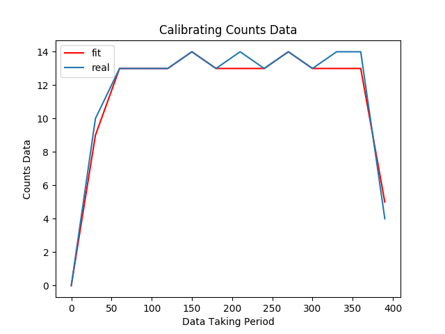</td>
    <td>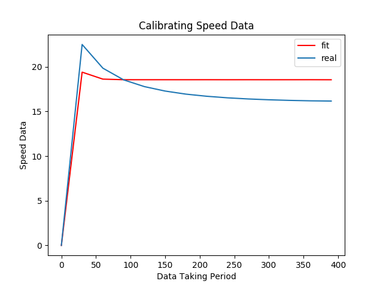</td>
  </tr>
</table>


## all parameters (speed)

The output log shows that the error decrease started off well and then stagnated. The optimization routine took longer than the counts data and had a higher error value, I had to terminate the sim.

```bash
Round 0, return: 165.72713363564804
Average, std returns: 165.72713363564804, 0.0
Average, std velocities: nan, nan
Average, std outflows: 1395.0, 0.0
Total time: 12.53541612625122
steps/second: 106.82887180548963
Data successfully loaded.
Data successfully loaded.
simmed params:  [ 0.4986763   0.52264328 21.98866884  0.88510069  1.05883732  0.10138411]
speed error: 3.8678879999999993
```

## v0 and T parameters (speed) 

```bash
Round 0, return: 171.46655859425698
Average, std returns: 171.46655859425698, 0.0
Average, std velocities: nan, nan
Average, std outflows: 1161.0, 0.0
Total time: 10.776818990707397
steps/second: 126.87927812669804
Data successfully loaded.
Data successfully loaded.
simmed params:  [24.81807881  1.77386694]
speed error: 0.5045680000000021
Optimization terminated successfully.
         Current function value: 0.504568
         Iterations: 60
         Function evaluations: 129
```

Took around 50 minutes but had the lowest error values, and the best simmed parameters.

<table>
  <tr>
    <td> Counts Data</td>
    <td> Speed Data</td>
  </tr>
  <tr>
    <td>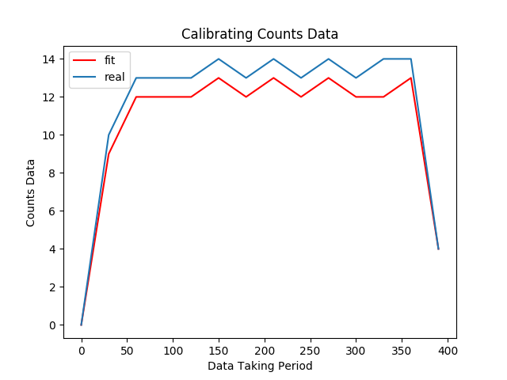</td>
    <td>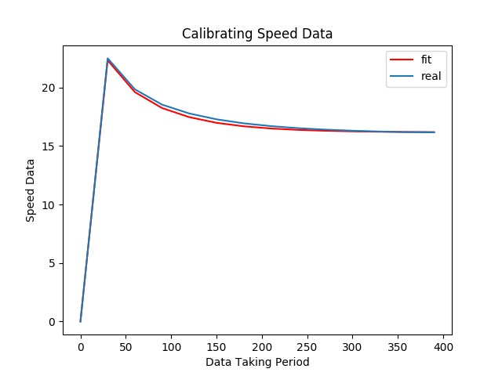</td>
  </tr>
</table>


## all parameters (speed+counts)

The output log shows errors decreasing much more quickly and prominently. the optimization routine ran faster comparatively, however, it didn't terminate on its own and I had to force quit it.

```bash
Round 0, return: 180.29050232201
Average, std returns: 180.29050232201, 0.0
Average, std velocities: nan, nan
Average, std outflows: 1305.0, 0.0
Total time: 11.832932710647583
steps/second: 114.0289048718916
Data successfully loaded.
Data successfully loaded.
simmed params:  [ 0.50107964  0.48399337 21.96866985  0.95544449  1.0381536   0.10230267]
error:  14.044269000000007
```

## v0 and T parameters (speed+counts) 

Using v0 = 20 and T = 1 as initial guess parameters.

From the output logs it seems like that the routine is converging onto certain param values that are not really minimizing the errors very much. The optimization was not doing so well even after 40 mins (error = 56.1466) so I forced quit it. 

The simmed params were as follows when I quit: [19.25907, 1.21013]

# Noise Calibrations <a name="5" /> #

## v0 and T parameters (counts) 
Using v0 = 20 and T = 1 as initial guess parameters.

The error started at 99.0 (highest initial error out of all sims with same conditions). After that the error started moving sporadically with lowest being 54.0 and the highest being 270.0. 10 minutes and there seems to be no convergence and the parameter set changed very minutely (20 -> 20.001, 1.0 -> 1.04).

After 30 minutes of waiting and no declining error trend I force quit the optimization routine.

## v0 and T parameters (speed) 
Using v0 = 20 and T = 1 as initial guess parameters.

Very similar behavior to the counts case, the initial error was the highest out of all similar sim conditions (170.413). There shows to be no convergence in error values, however, the parameter set for moved comparatively more (20 -> 18.9, 1 -> 1.06). Had to terminate the simulation after no sign of positive optimization.

## v0 and T parameters (speed+counts) 
Using v0 = 20 and T = 1 as initial guess parameters.

The error counts for this run was off the charts with the best number being 271.313. Highly stochastic data sets are worse off when two data sets are taken into consideration for optimization. I had to force quit the simulation.

## all parameters (speed)

## all parameters (counts)

## all parameters (speed+counts)

# Optimizing congested regime with non-constant inflow rates using s0,v0 and T as parameters and counts data <a name="6" /> ## 

Used the lower bound values as initial guess with v0 = 20.

```bash

```

# Obeservations/Need to look at:
- [x] using SLSQP for longer sims. Verified that for shorter ones, it is faster but higher error than Nelder-Mead. Same result for longer sims as well.
- [ ] idea: for Nelder-Mead -> create a threshold and stop sim when threshold is reached.
- [ ] idea: need to incorporate physical constraints to IDM params
- [ ] lamda analysis needed
- [ ] calibration of inflows needed 


